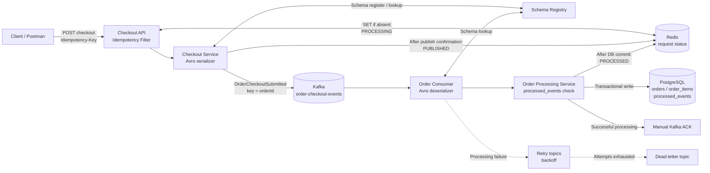

# Event-Driven Order Checkout | Kafka + Spring Boot

**An asynchronous order-checkout demonstration built with Apache Kafka, Spring Boot, Redis, PostgreSQL, Avro, Schema Registry and Docker Compose.**

This repository contains two independently deployed backend services. A checkout API validates and publishes an order event; a consumer persists it asynchronously. The project explores what happens beyond a successful publish: duplicate HTTP requests, Kafka redelivery, database failures, retries, and offset acknowledgment.

**Key concepts:** Event-driven architecture · Asynchronous communication · Two-layer idempotency · At-least-once-safe processing · Transactional persistence · Retry/DLT · Containerized local environment

> This is a backend engineering demonstration, not a complete payment, inventory or shipping platform.

## Architecture



Schema Registry is accessed by the producer's serializer and consumer's deserializer—not by Kafka itself. The two applications share the same Redis and PostgreSQL infrastructure through the Docker network.

## What this demonstrates

| Concern | Implementation |
| --- | --- |
| Asynchronous communication | Checkout publishes an event to Kafka; order persistence runs in a separate consumer service. |
| API idempotency | `Idempotency-Key` and Redis atomic `SET if absent` prevent repeated execution of the same request while the key is retained. |
| Consumer idempotency | PostgreSQL `processed_events` records completed event identities so a redelivered event can be skipped. |
| Transactional persistence | Order data and its processed-event marker are written inside a PostgreSQL transaction. |
| Reliable processing | Manual acknowledgment follows successful processing; the design tolerates Kafka redelivery rather than claiming end-to-end exactly-once delivery. |
| Failure handling | Spring Kafka retry topics use configured backoff, followed by a dead-letter topic when attempts are exhausted. |
| Event contract | Avro event schema, Confluent serializers/deserializers and Schema Registry. |
| Local infrastructure | Dockerfiles and separate Docker Compose configurations for the producer/infrastructure and consumer. |

## Repository layout

```text
.
├── justfordependency/             # Checkout API / Kafka producer
│   ├── compose.yaml               # Kafka, Schema Registry, Redis, PostgreSQL, UIs, producer
│   ├── dockerfile
│   ├── pom.xml
│   └── src/main/
│       ├── java/.../
│       │   ├── config/IdempotencyFilter.java
│       │   ├── config/KafkaProducerConfig.java
│       │   ├── rest/OrderController.java
│       │   └── service/CheckoutService.java
│       └── resources/avro/Order-checkout-submitted.avsc
└── kafka-consumer-demo/           # Kafka consumer / order persistence
    ├── compose.yaml               # Consumer on shared Docker network
    ├── dockerfile
    ├── pom.xml
    └── src/main/
        ├── java/.../
        │   ├── config/KafkaConsumerConfig.java
        │   ├── service/OrderProcessingService.java
        │   ├── entity/
        │   └── repository/
        └── resources/avro/Order-checkout-submitted.avsc
```

## Checkout API

**Endpoint:** `POST /orders/{orderId}/checkout`

```http
POST http://localhost:8086/orders/ORD-1001/checkout
Content-Type: application/json
Idempotency-Key: 550e8400-e29b-41d4-a716-446655440000
```

```json
{
  "customerId": "CUS-1001",
  "items": [
    { "sku": "SKU-101", "quantity": 2, "unitPrice": 24.99 },
    { "sku": "SKU-205", "quantity": 1, "unitPrice": 49.99 }
  ],
  "shippingAddress": {
    "street": "Keizersgracht 100",
    "city": "Amsterdam",
    "postalCode": "1015AA",
    "country": "NL"
  }
}
```

The producer builds an `OrderCheckoutSubmittedEvent` from the request. Its Kafka record uses `orderId` as the key, and carries the idempotency key in the header; the event identity is also derived from that key. The producer waits for the Kafka send result (with a timeout), then updates Redis to `PUBLISHED` and returns the 202 Accepted response with text:

```text
Your request is successfully Published
```

This response confirms the publish path, **not** completion of consumer-side PostgreSQL persistence.

## Processing and reliability

### 1. Request-level idempotency

The `IdempotencyFilter` requires `Idempotency-Key` for POST requests and atomically sets its Redis value to `PROCESSING` with a one-day TTL. If the key already exists, it returns a conflict instead of executing the checkout controller again. The filter also handles the request-validation failure path.

### 2. Event publication

`CheckoutService` creates the Avro event and publishes to `order-checkout-events`. Kafka partitions records by the configured key/partitioning behavior; using `orderId` keeps records for a given order consistently routed to a partition while partition configuration is unchanged. Kafka guarantees ordering **within a partition**, not across the topic.

### 3. Consumer-side deduplication and persistence

The consumer reads the event and `idempotencyKey` header, then calls `OrderProcessingService`. The service checks `processed_events` and uses a PostgreSQL transaction for the processed-event marker and order persistence. Database uniqueness constraints provide an additional safeguard beyond an application-level existence check.

### 4. Manual acknowledgment

Automatic Kafka offset commits are disabled, and the listener uses `manual_immediate` acknowledgment. It calls `acknowledge()` only after the processing method returns successfully. If PostgreSQL commits and the consumer crashes before the offset is committed, Kafka may redeliver the event; `processed_events` helps avoid repeating the business write.

### 5. Retry and dead-letter handling

`@RetryableTopic` is configured with **3 total attempts**, an initial **2-second** backoff and a **2.0 multiplier**. A `@DltHandler` logs events routed to the dead-letter path after retries are exhausted. This is a demonstration of failure routing, not an automated DLT recovery/replay system.

### Redis status lifecycle

```text
PROCESSING --(Kafka publish confirmed)--> PUBLISHED --(DB commit)--> PROCESSED
```

Redis is a lightweight processing-state store; PostgreSQL holds the durable business data. The current project does not provide a dedicated client-facing status query endpoint.

## Run locally with Docker Compose

**Requirements:** Docker Engine / Docker Desktop with Compose; ports listed below available.

The repository contains **two Compose files**. The producer-side Compose file creates the shared `shared-kafka-net` network and starts the infrastructure. The consumer-side Compose file joins that existing network.

From the repository root:

```bash
# 1. Start infrastructure and checkout API
docker compose -f justfordependency/compose.yaml up -d --build

# 2. Start the independent consumer service
docker compose -f kafka-consumer-demo/compose.yaml up -d --build
```

| Component | Local URL / port |
| --- | --- |
| Checkout API | `http://localhost:8086` |
| Consumer service | `localhost:8096` |
| Kafka broker (host listener) | `localhost:9092` |
| Schema Registry | `http://localhost:8081` |
| Kafka UI | `http://localhost:8080` |
| Redis | `localhost:6379` |
| RedisInsight | `http://localhost:5540` |
| PostgreSQL | `localhost:5433` |

The Compose files contain **local demonstration credentials**; replace these before use outside a local environment. The producer and consumer Dockerfiles use multi-stage Maven/Java builds. The consumer Compose configuration expects the shared network created by the first stack.

**Inspect the running workflow:**

```bash
docker compose -f justfordependency/compose.yaml logs -f producer-app
docker compose -f kafka-consumer-demo/compose.yaml logs -f consumer-app
```

Submit the example request, then use Kafka UI, RedisInsight and PostgreSQL to inspect the event, processing state and persisted order.

## Engineering scope and trade-offs

This project deliberately keeps the domain small so the messaging and reliability decisions are visible. It does **not** implement payment charging, shipping, inventory reservations, a client UI, end-to-end exactly-once transactions or automated DLT replay. Kafka publication, Redis updates and PostgreSQL commits are separate operations with potential failure windows; the design demonstrates idempotent handling of redelivery rather than claiming a distributed transaction across all three systems.

---

**Built to explore practical event-driven backend engineering:** accepting work synchronously, handing it off asynchronously, and making downstream processing resilient to duplicates and failures.
